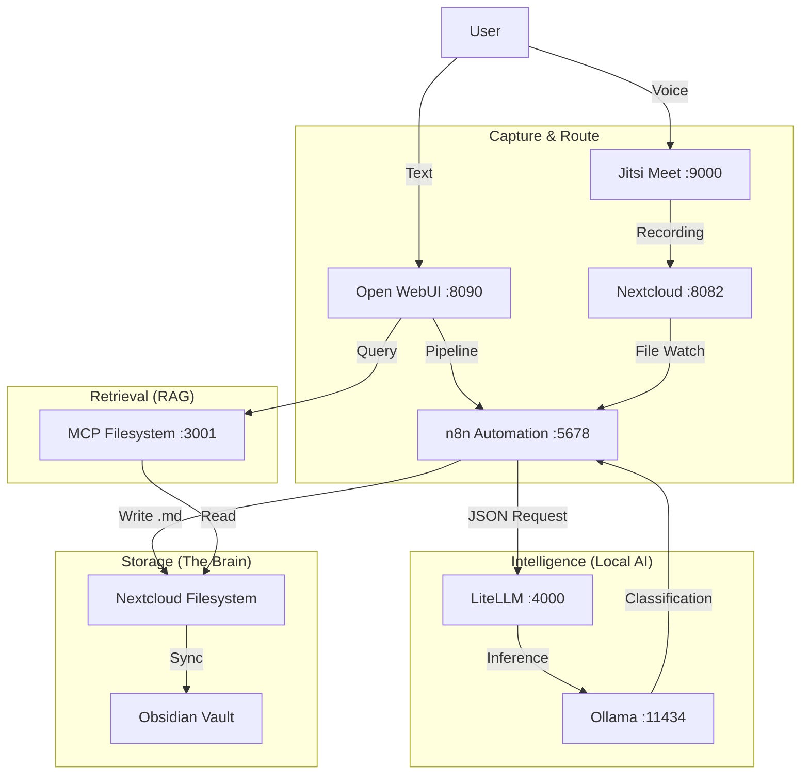

# Local AI Second Brain (The Hunnid Cortex)

**A privacy-first, self-hosted, AI-integrated knowledge management system.**

This repository documents the architecture and configuration for a "Second Brain" running entirely on local hardware (`hunnidserver`). It replaces SaaS silos with a self-hosted stack, using local LLMs to capture, sort, organize, and retrieve information.

## 🏗️ Architecture: The Loop

The system operates on a continuous loop: **Capture $\rightarrow$ Sort $\rightarrow$ Store $\rightarrow$ Surface**.



## 🛠️ The Live Stack

This system runs on Docker Compose on `hunnidserver` (Ubuntu).

| Service | Container Name | Port | Role |
| --- | --- | --- | --- |
| **Open WebUI** | `ai_openwebui` | `8090` | **The Interface.** Chat, Voice Input, and RAG. |
| **Ollama** | `ai_ollama` | `11434` | **The Brain.** Runs Llama 3, Mistral, Whisper (GPU Accelerated). |
| **n8n** | `ai_n8n` | `5678` | **The Nervous System.** Automation logic and routing. |
| **LiteLLM** | `ai_litellm` | `4000` | **The Router.** Proxies n8n/WebUI requests to Ollama. |
| **MCP Filesystem** | `ai_mcp_filesystem` | `3001` | **The Bridge.** Connects AI to Nextcloud files (`/data`). |
| **Postgres** | `ai_postgres` | `5433` | **Database.** Dedicated DB for n8n (mapped to avoid Immich conflict). |
| **Redis** | `ai_redis` | `6380` | **Cache.** Caching for AI stack (mapped to avoid Immich conflict). |
| **Nextcloud** | `nextcloud` | `8082` | **Sync.** Stores Jitsi recordings and Obsidian Vault. |
| **Immich** | `immich_server` | `2283` | **Visual Memory.** Photo/Video backup and analysis. |

## 🚀 Deployment & usage

### 1. Directory Structure

The stack lives in `/mnt/ai_storage/ai-stack/`.

* **Data Volume:** `/mnt/ai_storage/ai-stack/` (Configs for Ollama, n8n, etc.)
* **Nextcloud Data:** `/mnt/fastshare/containers/nextcloud/nextcloud/data/hunnid/files` (Mounted as Read-Only to MCP).

### 2. Startup

```bash
cd /mnt/ai_storage/ai-stack/
docker-compose up -d

```

### 3. How to Interact (The "User Manual")

#### **The Capture (Input)**

* **Text:** Open WebUI (`http://hunnidserver:8090`). Select the **"Second Brain"** model.
* *Type:* "Idea: We need a new compliance check for T+1 settlement."
* *Action:* The system automatically routes this to your Obsidian Inbox.


* **Voice:** Open Jitsi (`http://hunnidserver:9000` or app).
* *Action:* Record a meeting. It saves to Nextcloud. n8n picks it up, transcribes it via Whisper, and files it.


#### **The Retrieval (RAG)**

* **Context:** Open WebUI.
* **Action:** Ask "What did I say about the T+1 settlement last week?"
* **Backend:** WebUI hits `ai_mcp_filesystem` (:3001), which reads your Nextcloud files directly and answers with citations.

#### **The "Fix" (Feedback Loop)**

* If n8n files a note incorrectly, reply to the notification in WebUI: *"Fix: Move that to the Project Alpha folder."*
* n8n intercepts this command and moves the markdown file in Nextcloud.

## 🔌 Integration Points

### n8n Configuration

* **Postgres Connection:** Connects to `postgres` container on internal port `5432` (exposed externally as `5433`).
* **Ollama Connection:** HTTP Request Node  `http://litellm:4000` (Standardized OpenAI API).

### File System Bridging

* **MCP Server** is mounting the raw Nextcloud data directory.
* *Path:* `/mnt/fastshare/containers/nextcloud/nextcloud/data/hunnid/files`
* **Security Note:** This mount is Read-Only (`:ro`) to prevent the AI from accidentally deleting source files during RAG operations. Writes happen via n8n.

## 📜 Maintenance

* **Logs:** `docker logs -f ai_n8n` to see automation errors.
* **Updates:** `docker-compose pull && docker-compose up -d`

## ⚖️ License

MIT License

```

```
